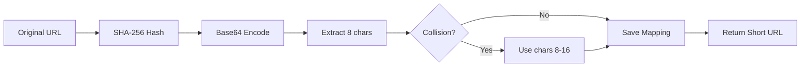
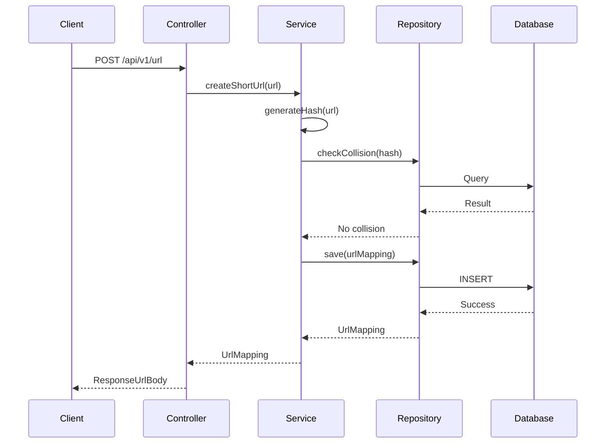

# 🔗 URL Shortener - Spring Boot

<div align="center">


**A production-ready URL shortening service built with Spring Boot, featuring JWT authentication, RESTful APIs, and secure URL management.**

[Features](#-features) • [Tech Stack](#-tech-stack) • [Architecture](#-architecture) • [Getting Started](#-getting-started) • [API Documentation](#-api-documentation)

</div>

---

## 📋 Overview

This URL Shortener is a robust, enterprise-grade microservice that transforms long URLs into compact, shareable links. Built with modern Spring Boot practices, it implements secure authentication, efficient hashing algorithms, and collision detection to ensure reliable URL mapping.

### 🎯 Key Highlights

- **Secure Authentication**: JWT-based authentication system with Spring Security
- **Smart URL Hashing**: SHA-256 algorithm with Base64 encoding for unique short URLs
- **Collision Detection**: Intelligent handling of hash collisions
- **RESTful API Design**: Clean, well-structured endpoints following REST principles
- **Production Ready**: Built with enterprise-grade patterns and best practices
- **Persistent Storage**: MySQL database integration with JPA/Hibernate

---

## ✨ Features

### Core Functionality
- ✅ **URL Shortening**: Convert long URLs into 8-character short codes
- ✅ **URL Redirection**: Automatic redirection from short URL to original URL
- ✅ **Reverse Lookup**: Retrieve short URL from original URL
- ✅ **URL Management**: List all URL mappings

### Security & Authentication
- 🔐 **User Registration & Login**: Secure user account management
- 🔑 **JWT Token Authentication**: Stateless authentication mechanism
- 🛡️ **Spring Security Integration**: Role-based access control
- 🚫 **Protected Endpoints**: Secure API access with token validation

### Technical Features
- 🔄 **Collision Handling**: Automatic detection and resolution of hash collisions
- 💾 **Database Persistence**: Reliable storage with MySQL
- 📊 **Entity Relationships**: Well-designed data models with JPA
- 🏗️ **Layered Architecture**: Clean separation of concerns (Controller → Service → Repository)

---

## 🛠 Tech Stack

### Backend Framework
- **Spring Boot 3.2.2** - Modern Java framework for building production-ready applications
- **Spring Data JPA** - Simplified database access and ORM
- **Spring Security** - Comprehensive security framework
- **Spring Web** - RESTful web services

### Security
- **JWT (JSON Web Tokens)** - Secure authentication (v0.12.5)
  - `jjwt-api` - JWT API
  - `jjwt-impl` - JWT implementation
  - `jjwt-jackson` - JSON processing

### Database
- **MySQL** - Relational database for persistent storage
- **Hibernate** - ORM framework

### Development Tools
- **Lombok** - Reduces boilerplate code
- **Maven** - Dependency management and build automation

### Algorithm & Encoding
- **SHA-256** - Cryptographic hash function for URL encoding
- **Base64 URL Encoding** - URL-safe encoding scheme

---

## 🏗 Architecture

### Project Structure
```
url-shortner/
├── src/main/java/com/harsh/urlshortner/
│   ├── controllers/          # REST API endpoints
│   │   ├── AuthenticationController.java
│   │   └── UrlMappingController.java
│   ├── entity/               # JPA entities
│   │   ├── UrlMapping.java
│   │   └── User.java
│   ├── models/               # DTOs and request/response models
│   │   ├── LoginUserDto.java
│   │   ├── RegisterUserDto.java
│   │   ├── LoginResponse.java
│   │   ├── RequestUrlBody.java
│   │   └── ResponseUrlBody.java
│   ├── repository/           # Data access layer
│   │   ├── UrlMappingRepository.java
│   │   └── UserRepository.java
│   ├── service/              # Business logic
│   │   ├── UrlMappingService.java
│   │   ├── UrlShortnerService.java
│   │   └── UserAuthenticationService.java
│   └── security/             # Security configuration
│       ├── config/
│       │   ├── JwtAuthenticationFilter.java
│       │   ├── SecurityConfiguration.java
│       │   └── UserSecurityConfig.java
│       ├── exception/
│       │   └── JwtAuthenticationEntryPoint.java
│       └── service/
│           └── JwtService.java
└── pom.xml
```

### URL Shortening Algorithm



### Request Flow



---

## 🚀 Getting Started

### Prerequisites

- **Java 17** or higher
- **Maven 3.6+**
- **MySQL 8.0+**
- **Git**

### Installation

1. **Clone the repository**
   ```bash
   git clone https://github.com/yourusername/url-shortner-spring-boot.git
   cd url-shortner-spring-boot
   ```

2. **Configure MySQL Database**
   
   Create a new database:
   ```sql
   CREATE DATABASE url_shortener;
   ```

3. **Update Application Properties**
   
   Edit `src/main/resources/application.properties`:
   ```properties
   spring.datasource.url=jdbc:mysql://localhost:3306/url_shortener
   spring.datasource.username=your_username
   spring.datasource.password=your_password
   
   spring.jpa.hibernate.ddl-auto=update
   spring.jpa.show-sql=true
   spring.jpa.properties.hibernate.dialect=org.hibernate.dialect.MySQLDialect
   
   # JWT Configuration
   jwt.secret=your-secret-key-here
   jwt.expiration=86400000
   ```

4. **Build the project**
   ```bash
   ./mvnw clean install
   ```

5. **Run the application**
   ```bash
   ./mvnw spring-boot:run
   ```

The application will start on `http://localhost:8080`

---

## 📡 API Documentation

### Authentication Endpoints

#### Register User
```http
POST /api/auth/register
Content-Type: application/json

{
  "username": "john_doe",
  "email": "john@example.com",
  "password": "securePassword123"
}
```

#### Login
```http
POST /api/auth/login
Content-Type: application/json

{
  "email": "john@example.com",
  "password": "securePassword123"
}
```

**Response:**
```json
{
  "token": "eyJhbGciOiJIUzI1NiIsInR5cCI6IkpXVCJ9...",
  "expiresIn": 86400000
}
```

### URL Management Endpoints

> **Note:** All URL endpoints require JWT authentication. Include the token in the Authorization header:
> ```
> Authorization: Bearer <your-jwt-token>
> ```

#### Create Short URL
```http
POST /api/v1/url
Content-Type: application/json
Authorization: Bearer <token>

{
  "url": "https://www.example.com/very/long/url/that/needs/shortening"
}
```

**Response:**
```json
{
  "originalUrl": "https://www.example.com/very/long/url/that/needs/shortening",
  "shortUrl": "aB3dEf9H"
}
```

#### Redirect to Original URL
```http
GET /api/v1/url/{shortUrl}
```

**Response:** HTTP 302 Redirect to original URL

#### Get Short URL from Original
```http
GET /api/v1/url/original
Content-Type: application/json
Authorization: Bearer <token>

{
  "url": "https://www.example.com/very/long/url/that/needs/shortening"
}
```

#### Get All URL Mappings
```http
GET /api/v1/url
Authorization: Bearer <token>
```

**Response:**
```json
[
  {
    "originalUrl": "https://www.example.com/url1",
    "shortUrl": "aB3dEf9H"
  },
  {
    "originalUrl": "https://www.example.com/url2",
    "shortUrl": "xY7zWq2K"
  }
]
```

---

## 🔐 Security Features

### JWT Authentication Flow

1. User registers or logs in with credentials
2. Server validates credentials and generates JWT token
3. Client stores token and includes it in subsequent requests
4. Server validates token on each protected endpoint
5. Token expires after configured time period

### Security Configuration

- **Password Encoding**: BCrypt password hashing
- **CORS**: Configurable cross-origin resource sharing
- **CSRF Protection**: Disabled for stateless JWT authentication
- **Session Management**: Stateless session policy
- **Authentication Entry Point**: Custom JWT authentication error handling

---

## 💡 How It Works

### URL Shortening Process

1. **Input**: User provides a long URL
2. **Hashing**: System applies SHA-256 hash to the URL
3. **Encoding**: Hash is encoded using Base64 URL-safe encoding
4. **Truncation**: First 8 characters are extracted as the short code
5. **Collision Check**: System verifies uniqueness in database
6. **Fallback**: If collision detected, uses characters 8-16
7. **Storage**: Mapping is persisted to MySQL database
8. **Response**: Short URL is returned to user

### Redirection Process

1. User accesses short URL (e.g., `http://shorturl.com/aB3dEf9H`)
2. System extracts short code from URL
3. Database lookup retrieves original URL
4. HTTP 302 redirect sends user to original destination

---

## 🧪 Testing

Run the test suite:
```bash
./mvnw test
```

---

## 📈 Future Enhancements

- [ ] Analytics dashboard for URL click tracking
- [ ] Custom short URL aliases
- [ ] QR code generation for short URLs
- [ ] Rate limiting and API throttling
- [ ] URL expiration and TTL management
- [ ] Admin panel for URL management
- [ ] Docker containerization
- [ ] Redis caching for improved performance
- [ ] OpenAPI/Swagger documentation

---

## 🤝 Contributing

Contributions are welcome! Please feel free to submit a Pull Request.

1. Fork the project
2. Create your feature branch (`git checkout -b feature/AmazingFeature`)
3. Commit your changes (`git commit -m 'Add some AmazingFeature'`)
4. Push to the branch (`git push origin feature/AmazingFeature`)
5. Open a Pull Request

---

## 📄 License

This project is licensed under the MIT License - see the LICENSE file for details.

---

## 👨‍💻 Author

**Harsh Nayak**

- GitHub: [@yourusername](https://github.com/yourusername)
- LinkedIn: [Your LinkedIn](https://linkedin.com/in/yourprofile)
- Email: your.email@example.com

---

## 🙏 Acknowledgments

- Spring Boot team for the excellent framework
- JWT.io for JWT implementation guidance
- The open-source community for inspiration and support

---

<div align="center">

**⭐ Star this repository if you find it helpful!**

Made with ❤️ using Spring Boot

</div>
